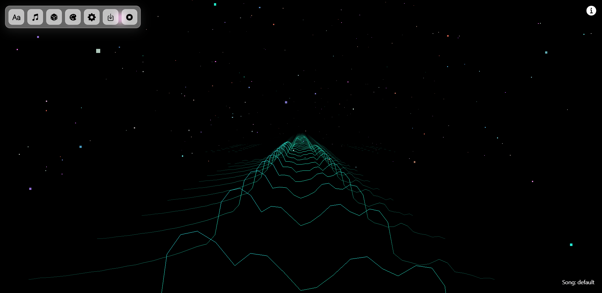
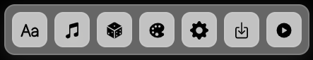
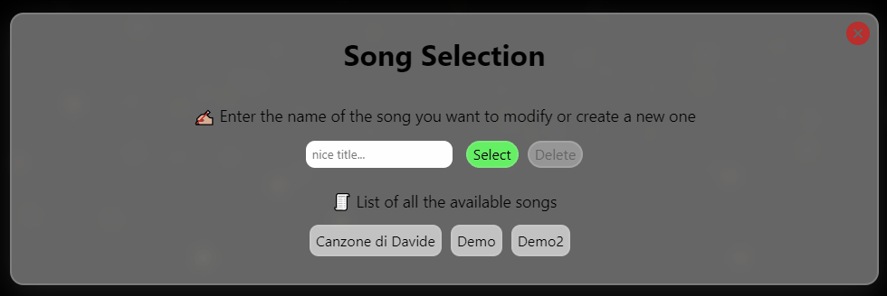
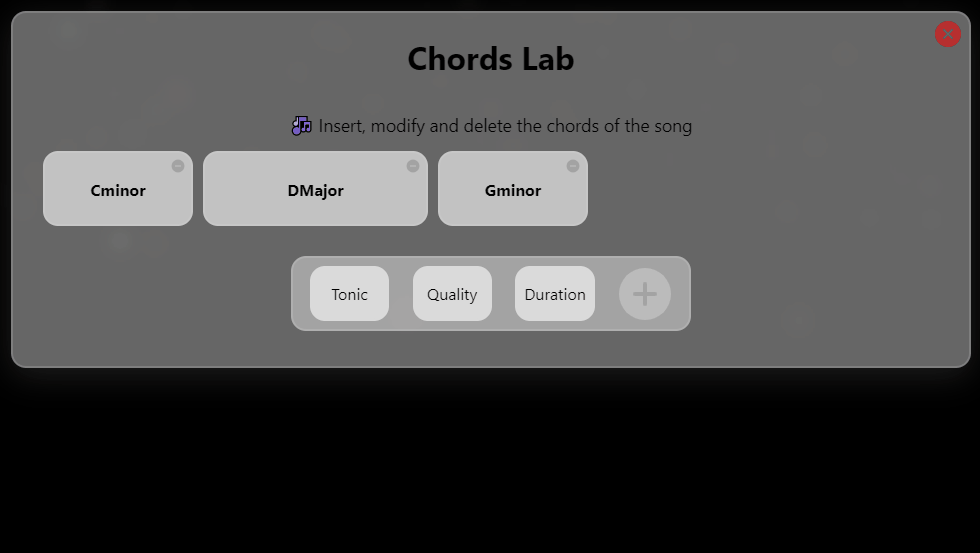
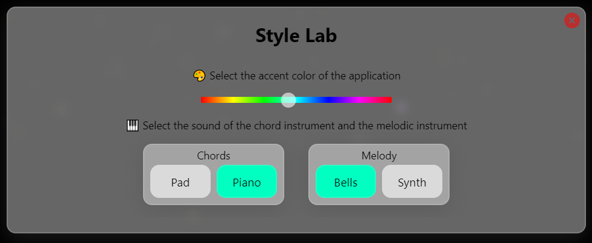
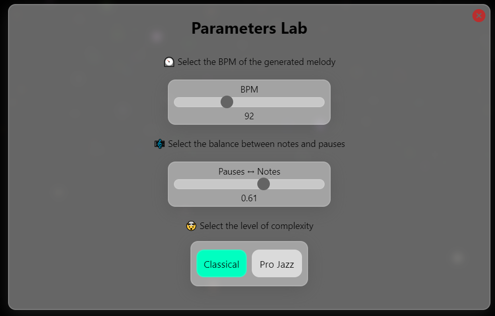
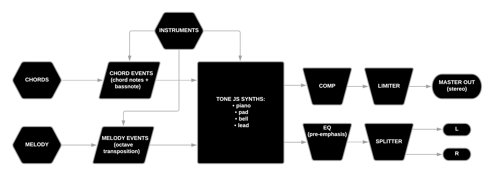

# Falling Notes 🌠

Welcome to Falling Notes! The aim of this musical-app is to provide a functional and beautiful melody generator. You can insert the chords you want and we will do our best to compute a melody that fits the progression. You can tweak some parameters and listen to the result on the fly with a couple of sounds that we provide. In the meantime, the background will display a visual and musical landscape that evolves according to the chord progression and the melody. If you like the result and want to experiment more, you can download a MIDI file containing both the melody and the chords.
If you have any doubt you can find an "info" section on the top right, which briefly resumes the content of this documentation.

Enjoy!

PS: Here we provide a short [demo](https://youtu.be/KQRXkWLWtYU) of the app.

## Part 1: Graphical User Interface

This is how the main screen of the app looks like when reproducing a song:

In the next sections we will describe in detail the functions of every button.

### Main Menu

The main menu consists of 6 interactive buttons that provide access to the main functionality of the app


1. [Song Title Selection](#song-title-menu-)
2. [Chords Menu](#chords-menu-)
3. [Melody Generator](#melody-generator-)
4. [Style Menu](#style-menu-)
5. [Parameters menu](#parameters-menu-)
6. [Download MIDI](#midi-downloader-)
7. [Start/Stop transport](#play-)

### Song Title Menu 🔡

Start from here if you want to create your beautiful song. You can select a title from the list (and modify an existing song) or you can create a new one by typing a new title (make sure it is different from other titles!).
If you have writer's block, don't worry! You can still use the app with a 'default' song. Finally, you can also delete the selected song from the database.

\*opening this menu will also stop the reproduction of the song as soon as the transport ends

### Chords Menu 🎵

Here you can add, delete and modify the chords in your song. Every change will be saved when you exit the menu.


\*opening this menu will also stop the reproduction of the song as soon as the transport ends

### Melody Generator 🎲

Pressing this button will generate a new melody based on the current chords the parameters' selection. Careful! The old melody will be overwritten. If you want to save the melody as a MIDI file please refer to
[Midi Downloader](#midi-downloader-)

\*pressing this button will also stop the reproduction of the current song as soon as the transport ends

### Style Menu 🎨

Here you can express your artistic side. You can modify the main color of the interface but also the type of sound used by the app to reproduce your song.



### Parameters Menu ⚙

This is the brain of the melody computation. Select the tempo of your song, the balance beetween pauses and notes and the complexity of the generated melody. If you modify this parameters and you want to listen to the result, remember to [recompute the melody](#random-melody-generator-) before play.

\*opening this menu will also stop the reproduction of the song as soon as the transport ends

### Midi Downloader ⬇

This button generates and downloads a midi file containing the chords and the latest melody (in two separate tracks) of the currently selected song. Of course the melody is yours, and you can use it in your favourite DAW.

### Play! ⏯

Press this button to start/stop the transport and generate the animation. Wooow!

## Part 2: Technical Implementation

### Overview: React & Styled components

The app is built using the React framework. This allowed us not only to easily manage the rendering of the correct component but also its state. It also improved the code readibility and reusability. But what is a "component"? Components are independent and reusable bits of code. They serve the same purpose as JavaScript functions, but work in isolation and return HTML via a render() function; let's see an example:

```javascript
const Component = (props) => {
    const [state, modState] = useState('changed state');
    const sayHello = () => {
        console.log(state);
    };
    return (
        <ContainerComponent onClick={props.doSomething}>
            <SubComponent className="SubComp" onClick={sayHello}>
                <p>This is a paragraph in component in a component!</p>
            </SubComponent>
        </ContainerComponent>
    );
};

export default Component;
```

Notice that a component contains its structure (and can be made of nested components...), its functions (or can call parent component's function passed as prop) and even some states. Father componets can always provide some of this functionality by passing some props to their childs.

To simplify the styling process we also used syled-components, a library that allows customize the CSS of a component directly inside of it:

```javascript
const StyledComponent = styled.div`
    width: 10px;
    height: 10px;
    background: red;
`;

const Component = (props) => {
    return <StyledComponent>Little Red Box</StyledComponent>;
};

export default Component;
```

#### App

This is the root component which contains the basic logic of the app, the global state and all the other nested components.

-   State: it includes the chords, melody (which are stored in arrays of objects) and the parameters object, but also other arrays to manage the open/close state of the menus or booleans like the play/stop state of the transport...

```javascript
chords = [
    {
        tonic: 'C',
        quality: 'minor',
        duration: '2'

    },
    {
        tonic: 'G',
        quality: 'Major',
        duration: '4'

    },
    ...
]
```

-   All the functions that need to access directly the state are placed here (for example the DB management or the computation of the melody).
-   Effects: side functions called when a given state changes; we used it to initialize the app (empty dependency array).
-   Nested components: the organized structure of the whole app, as well as the props passed to every children.

#### Main Menu

This is a simple component that manages the open/closed state of every menu in our app; It also calls some utility functions, for example the one used to compute a melody, play/pause transport or create and download a MIDI file.

#### Menus

Every menu presented in the first section is made of several components grouped together to create the interface; in general they are made of:

-   Blurred background page
-   Modal menu (the actual menu window)
-   Header menu (contains the title of the menu and the exit button)
-   Menu content (varies according to the specific menu, for example sliders, buttons, text, forms...)

A menu can also include one or more internal states (which are used for internal operations and are not visibles from the parent).

#### Background

We generated the background using THREE JS, but we still needed to provide some properties from the main state of the app (eg: color); that's why we needed to include it in a React component and pass it as a refs.

### Song Database

The Songs created by the users are synchronized on a server using Firebase by Google. The state is costantly saved (every time a menu is closed) so that it is possible to continue modifying previously created songs. At launch we get a "default" song, but as soon as the user submits a song name in the [Title Menu](#song-title-menu-), a new empty state is initialized and uploaded to the DB (if the title didn't exixt in the database) or the selected song is loaded and ready to generate a new melody.

```javascript
const refSongs = firebase.firestore().collection('songs');
refSongs
    .doc(docName)
    .get()
    .then((doc) => {
        if (doc.exists) {
            // docName is in the server
            const items = doc.data();
            if (items) {
                let loadSong = [];
                for (const key in items) {
                    loadSong = [...loadSong, items[key]];
                }
                // load the chords into the song, erase current melody
                updateChords(loadSong);
                updateMelody([]);
            }
        } else {
            // docName is not in the server...
            updateChords([]);
            updateMelody([]);
            updateServer(docName);
        }
    })
    .catch((error) => {
        console.log('Error getting document:', error);
    });
```

If the "Delete" button is pressed, the song is deleted from the databese and you won't be able to recover it.

### Melody Generation

### Sound Generation (Tone)
The sound engine is located in the Sound module, where an instance of Tone Js Context is declared and exported towards the other modules.

```javascript
// exports to make the visualizer work
export var context = Tone.getContext();
export var busLeft = analyserBusLeft;
export var busRight = analyserBusRight;
```

The signal flow of the Sound module is the following:



The chords and the melody are preprocessed and passed to a function that creates a Tone Loop of note events.

```javascript
// function to create the chord loop
function createChordLoop(instrument) {
    if (chordSequence != []) {
        let loop = new Tone.Loop(function (time) {
            
            chordSequence.forEach((chord) => {
                instrument['synth'].triggerAttackRelease(
                    chord.notes,
                    parseInt(chord.duration)*(120/songTempo),
                    time+chord.time*(120/songTempo),
                    1
                );
            });
        }, loopDuration*(120/songTempo));
        loop.start();
        return loop
    }
}

// function to create the melody loop
function createMelodyLoop(instrument, transposition) {
    if (melodySequence != []) {
        let loop = new Tone.Loop(function (time) {
            // for each element, if it's a note, trigger it
            melodySequence.forEach((note) => {
                if (note.type == 'note') {
                    let m = note.pitch;
                    // midi to freq conversion + transposition
                    let f = Math.pow( 2, (m-69+(transposition*12))/12 ) * 440;
                    instrument['synth'].triggerAttackRelease(
                        f,
                        note.duration*(120/songTempo),
                        time+note.onsetTime*(120/songTempo),
                        1
                    );
                } 
            });
        }, loopDuration*(120/songTempo));
        loop.humanize = instrument['humanize'];
        loop.start();
        return loop
    }
}
```

The instruments parameters are used to choose which of the four existent synths are used to produce sound. These synths are fixed and toggled when the user select them from style menu: one between Pad and Piano for the chords part and one between Bell and Synth for the melody part.

```javascript
// electric piano type of synth, made with a distorted sine wave, tremolo and chorus
function createSynthPiano() {

    let polySynthPiano = new Tone.PolySynth();
    polySynthPiano.set({
        volume: baseVolume + 3.0,
        oscillator: {
            type: "fatsine",
            spread: Math.random()*20
        },
        envelope: {
            attack: 0.075,
            decay: 6,
            sustain: 0.1,
            release: 0.1,
        }
    });

    let eq = new Tone.EQ3(-3, 0, 0);
    let tremolo = new Tone.Tremolo(10, 0.5).start();
    let chorus = new Tone.Chorus(0.1, 7, 0.3).start();

    let chain = [polySynthPiano, tremolo, eq, chorus];

    connectEffectsChain(chain);

    return {
        synth: polySynthPiano,
    };
}
```

These synths are then routed to two separate busses: one towards the master out of the system and another towards a two-way mono out. Note that the latter is processed with a pre-emphasis eq to enhance the hi frequency component visualization.

```javascript
// function for chaining the instruments to the master bus and the analyzer busses
function connectEffectsChain(chain) {
    for (let i = 0; i < chain.length - 1; i += 1) {
        chain[i].connect(chain[i + 1]);
    }
    chain[chain.length - 1].connect(eq);
    chain[chain.length - 1].connect(comp);
}
```

### Sound Visualization (THREE JS)
The app we built is not just a random melody generator but is able to play it and visualize it through this interface resembling a space environment with falling stars and a variable terrain.
This terrain is actually generated by the envelope of the FFT of the signal coming out from the splitted bus, so it’s audio reactive and also represent the stereo image. The terrain actually changes shape as the timbre of the sounds being played.

```javascript
// AUDIO VISUALIZER UPDATE
function updateSpectrum(world, width, depth) {
    let spectrumLeft = new Uint8Array(bufferLength);
    let spectrumRight = new Uint8Array(bufferLength);
    let spectrum = new Uint8Array(bufferLength * 2);

    analyserLeft.getByteFrequencyData(spectrumLeft);
    analyserRight.getByteFrequencyData(spectrumRight);

    spectrum.set(spectrumRight.reverse());
    spectrum.set(spectrumLeft, spectrumRight.length);

    updateWorld(world, mainColor, width, depth, spectrum);
}
```

Style parameters affect the color accent of each component of the 3D scene: the terrain, the star field and the star fall. The star field is updated each time the color changes with new stars position and colors. For obtaining a rich color palette, this object calculate a color for each star by slightly varying the Hue component in the HSL range of the main color controlled in the style menu.

```javascript
// random color palette generator
color = color.getHSL(color);
let hueOffset = (Math.random() - 0.5) * 0.01;
if (color.h + hueOffset < 0) {
    hueOffset = -hueOffset;
} else if (color.h + hueOffset > 1) {
    hueOffset = -hueOffset;
}
color = color.offsetHSL(hueOffset, (Math.random() - 0.5) * 0.1, 0);
color = color.getHSL(color);
color = color.setHSL(color.h, color.s, 0.5 + Math.random() * 0.3)
```

The falling stars are declared at the initialization of the module, as the rest of the object, but they get visible only when the app is playing. These stars are initialized with random initial position in the upper half of the 3D world and with a target position randomly chosen around the point the camera is looking by. By computing the velocity vector as the difference of these two points, we get the impression these stars are falling from the sky towards the horizon.Note as the timer of each star get close to its death time, the end point of the Three JS line representing the tail of the falling star, get closer to the starting point.

```javascript
function updateStar(star, timer, radius) {
    let positions = star.geometry.attributes.position.array;
    let velocity = star.geometry.attributes.velocity.array;

    let life = timer.getElapsedTime();
    let resetTime = 2;
    let progress = life / resetTime;

    // tail disappears
    if (progress < 0.75) {
        // line start
        positions[0] += velocity[0];
        positions[1] += velocity[1];
        positions[2] += velocity[2];
    }

    // color ramp to death color
    let color = mainColor.clone();
    let deathColor = mainColor.clone();
    deathColor = deathColor.getHSL(deathColor);
    deathColor = deathColor.setHSL(deathColor.h, 1, 0);
    color = color.lerp(deathColor, progress);
    star.material.color = color;

    // line end
    positions[3] += velocity[3];
    positions[4] += velocity[4];
    positions[5] += velocity[5];

    // reset call
    if (progress > 1) {
        resetStar(star, timer, radius);
    }
}

 // star fall handler
            if (triggerStarFall == 1) {
                async function startStarFall() {
                    timer1.start();
                    scene.add(star1);
                    await sleep(500);
                    timer2.start();
                    scene.add(star2);
                    await sleep(500);
                    timer3.start();
                    scene.add(star3);
                    await sleep(500);
                    timer4.start();
                    scene.add(star4);
                    await sleep(500);
                    timer5.start();
                    scene.add(star5);
                }
                startStarFall();
                triggerStarFall = 0;
            } else if (triggerStarFall == -1) {
                async function endStarFall() {
                    await sleep(2600);
                    scene.remove(star1);
                    scene.remove(star2);
                    scene.remove(star3);
                    scene.remove(star4);
                    scene.remove(star5);
                    resetStar(star1, timer1, starFallRadius);
                    resetStar(star2, timer2, starFallRadius);
                    resetStar(star3, timer3, starFallRadius);
                    resetStar(star4, timer4, starFallRadius);
                    resetStar(star5, timer5, starFallRadius);
                }
                endStarFall();

                timer1.stop();
                timer2.stop();
                timer3.stop();
                timer4.stop();
                timer5.stop();
                triggerStarFall = 0;
            } else {
                updateStar(star1, timer1, starFallRadius);
                updateStar(star2, timer2, starFallRadius);
                updateStar(star3, timer3, starFallRadius);
                updateStar(star4, timer4, starFallRadius);
                updateStar(star5, timer5, starFallRadius);
            }
```

React UseEffect hook is used to handle color accent and melody/chords changes.

```javascript
// COLOR PALETTE MANAGEMENT
useEffect(() => {
    mainColor = mainColor.getHSL(mainColor);
    mainColor = mainColor.setHSL((props.color + 0.1) / 360, 0.7, 0.5);
    colorNeedsUpdate = 1;
}, [props.color]); // update when prop changes

// TRIGGER STAR FALL
useEffect(() => {
    if (props.isPlaying == 0) {
        triggerStarFall = -1;
    } else if (props.isPlaying == 1) {
        triggerStarFall = 1;
    }
}, [props.isPlaying]); // update when prop change
```

### Midi Writer

When pressing the [Download Midi](#midi-downloader-) button, the current melody, chords, tempo and song name are passed to a function that generates a MIDI file exploiting the midi-writer external library. For every note in the melody we generate a MIDI event, taking care of pauses.

```javascript
melody.forEach((note) => {
    if (note['type'] === 'pause') {
        // collect pauses
        pause = pause + note['duration'];
    }
    if (note['type'] === 'note') {
        // manage notes
        pause = convertDurationValues(pause);
        melodyMidi.addEvent(
            [
                new MidiWriter.NoteEvent({
                    pitch: note['pitch'],
                    duration: 4 / note['duration'],
                    wait: pause,
                }),
            ],

            function (event, index) {
                return { sequential: true };
            }
        );
        pause = 0;
    }
});
```

Chords at first are turned into array of parallel notes, then underly a similar process before being saved in a different track.

A link containing the two midi tracks is generated and appended to the document body. A simulated click to this element occurs and the download begins.

## Part 3: Additional Material

These are the external libraries that we used during the production of our app:

-   React
-   React Icons: Ionicons 5
-   Styled Components
-   Firebase
-   React Beautiful DnD
-   React Color
-   Tone JS
-   Three JS
-   Midi Writer
